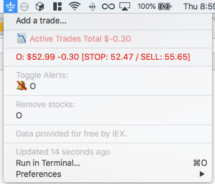

# stock-trades-tracker
Stock Trades Tracker plugin for [BitBar](https://github.com/matryer/bitbar)

## What is this?
This is a BitBar plugin that tracks stock trades.
- Enter a trade after entering the market.
- Set a notification for Stop Loss and Sell points
- Track your portfolio over time

## Future goals for plugin
- Add and track starting capital
- Calculate how large a trade should be given current capital and risk wanting to take
- Variable Stop/Sell %'s per trade
- ~~Track exits~~
- ~~Save full trade in separate file (buy price, sell price, numbers of shares, total gain/loss)~~
- ~~Track Total P/L for trades~~
- Allow partial sells + adding to positions
- Track portfolio value over time, am I on track for my goals?
- Try to hook into Robinhood's API? Other brokerage API's to get trades automagically

#### Inspirations from the following plugins:
- https://github.com/lukstei/bitbar-plugins/blob/master/Finance/stock-portfolio-pl.5m.py
- https://github.com/carlsonorozco/coin-alert

##### Note to self:
- Emojis:  
    - https://github.com/diy/NSStringEmojize/blob/master/NSStringEmojize/emojis.h
    - https://www.webpagefx.com/tools/emoji-cheat-sheet/
